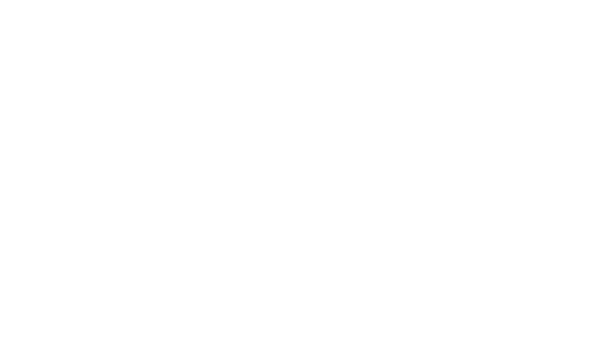
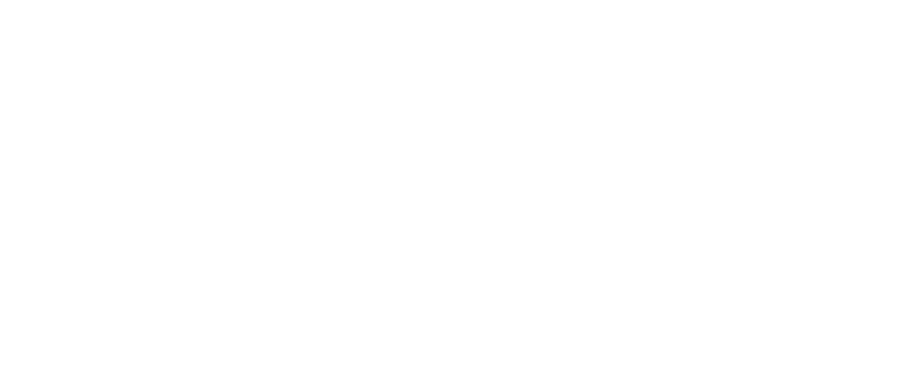

# Protocol-Oriented
# Programming
# in Networking
#### ishkawa

Note:
- それでは、発表を始めます。
- よろしくお願いします。


## ishkawa?


Note:
- はじめに、少しだけ自己紹介をします。
- GitHub IDはishkawaです。
- APIKitというネットワーキングライブラリをつくっていたり、他のプロジェクトにパッチを送ったりしています。


# Overview

#### Protocol-Oriented Programming in Networking

1. Wrapping NSURLSession using protocols
2. Generic programming on the protocols
3. Combination with RxSwift

Note:
- 自己紹介はここまでにして、本題に入りましょう。
- 今日の話題はネットワーキングにおけるProtocol-Oriented Programmingです。トピックは3つあります。
- はじめに、NSURLSessionをプロトコルを使ってラップすると、どのような設計が実現できるのかお話しします。
- 続いて、そのプロトコルの上でのジェネリックなプログラミングがどんなものになるのかお話しします。
- 最後に、Rxと組み合わせると、iOS開発がどのようなものに変わるのか説明します。


# Topic 1

Wrapping NSURLSession using protocols
 
<ul class="fragment fade-in">
<li>To make call-site code simpler</li>
<li>To get responses type-safely</li>
</ul>

Note:
- では早速、1つ目の話に入っていきましょう。
- NSURLSessionをプロトコルを使ってラップします。
- 目的は2つあります。
- 1つ目はコールサイトのコードをよりシンプルにすることです。
- 2つ目はレスポンスをタイプセーフに受け取るということです。


## Goal



Note:
- 今回目標とする設計は図のようになります。
- 元々Foundationで提供されている仕組みは図の左のものです。
- NSURLRequestをNSURLSessionに渡してNSDataを受け取ります。
- さらに、JSONパースを行ってAnyObjectを取得し、最後にアプリ上のレスポンス型にマッピングします。

- 一方、今回これをラップしてつくるものが図の右のものです。
- リクエスト・セッション・レスポンスという構造は変わらないのですが、左の図の5つのすべてがSessionの中で完結しています。
- ステップを減らすことも良いことですが、ここで最も注目すべきポイントは、右の図ではレスポンスの型がリクエストの型に紐付いて、Request.Responseとして表されていることです。


## Goal

```swift
let request = Request()

Session.sendRequest(request) { result in
    // result: Result<Request.Response, Error>
}                           👆
```

Note:
- では、そのコールサイトのコードを見てみましょう。
- リクエストをセッションに渡して、Result<Request.Response, Error>を受け取っています。
- 指で指されているところがRequest.Responseとなっていて、ここの型がリクエストに応じて変化するということです。


## Goal

```swift
let request = CreateIssueRequest(repositoryID: 123, title: "Test")

Session.sendRequest(request) { result in
    // result: Result<Issue, Error>
}
```

```swift
let request = SearchRepositoriesRequest(query: "swift")

Session.sendRequest(request) { result in
    // result: Result<PaginationResponse<Repository>, Error>
}
```

The type of result changes depending on the request type

Note:
- 例を見せて説明します。
- 1つ目の例は、CreateIssueRequestという、イシューを作成するリクエストです。
- 2つ目の例は、SearchRepositoriesRequestという、リポジトリを検索するリクエストです。
- リクエストとレスポンスの型を紐づけるということは、CreateIssueRequestを送れば、作成したIssueが返ってきて、SearchRepositoriesRequestを送れば、検索に引っかかったリポジトリが返ってくるということです。
- つまり、リクエストの型さえ指定すれば、レスポンスの型は自動的に決定されることになります。
- こうすることで、コールサイトはシンプルかつ安全にレスポンスを取得できるようになります。


## Why Protocol?

1. To associate response type with request type
2. To provide flexible default implementation

Note:
- では、なぜこの設計にプロトコルが適しているのか説明します。
- これには様々な理由がありますが、特に大きいものが2つあります。


## Why Protocol?

1. To associate response type with request type
2. <div style="opacity: 0.3">To provide flexible default implementation</div>

Note:
まず、1つ目の理由は、リクエストとレスポンスの型の紐づけを可能にするためです。


### Associating response type
### with request type

```swift
protocol RequestType {
👉  typealias Response

    var baseURL: NSURL { get }
    var method: HTTPMethod { get }
    var path: String { get }
    var parameters: [String: AnyObject] { get }

👉  func responseFromObject(
        object: AnyObject,
        URLResponse: NSHTTPURLResponse) throws -> Response
}
```

Note:
- リクエストのプロトコルはこんな感じに定義します。
- リクエストとレスポンスの型の紐付けに関連する箇所は指マークで指されている2箇所です。
- 1箇所目のtypealias Responseから見てみましょう。
- このような、プロトコル上のtypealiasは、Swiftの仕様上ではassociated typeと呼ばれるもので、型に型を紐づけるものです。
- つまり、ここでtypealias Responseが表すことは、リクエストの型の中にはResponseという名前の型があるということです。
- こうして、プロトコル上では、リクエストとレスポンスの型の紐付けが可能となります。
- 続いて、2箇所目のresponseFromObject()を見てみましょう。
- このメソッドの戻り値は、1箇所目で指定したResponseとなっています。
- つまり、responseFromObject()の戻り値は、リクエストの型ごとに変わるということになります。


### Associating response type
### with request type

```swift
class Session {
    ...

    func sendRequest<Request: RequestType>(
        reqeust: Request,
        handler: Result<Request.Response, Error> -> Void) {
        do {
            let data: NSData = ...
            let json: AnyObject = ...
👉          let response = request.responseFromObject(json...)
👉          handler(.Success(response)) // Request.Response
        } catch {
            handler(.Failure(error))
        }
    }
}
```

Note:
- responseFromObject()は、リクエストの生成からレスポンス型へのマッピングまでを行うSessionのsendRequest()内で使われます。
- 指で指されている箇所を見てください。
- NSDataを取得して、JSONのAnyObjectを取得するまでは普通なのですが、ここでresponseFromObject()が使われているので、sendRequest()の結果はリクエスト毎に違う型を返すようになっています。


### Associating response type
### with request type

```swift
let request = CreateIssueRequest(repositoryID: 123, title: "Test")

Session.sendRequest(request) { result in
    // result: Result<Issue, Error>
}                       👆
```

```swift
let request = SearchRepositoriesRequest(query: "swift")

Session.sendRequest(request) { result in
    // result: Result<PaginationResponse<Repository>, Error>
}                                👆
```

The type of result changes depending on the request type

Note:
- その結果が、初めにお見せした、リクエストの型に応じてレスポンスの型が変わるというものです。
- CreateIssueRequestを送れば、作成したIssueが返ってきて、
- SearchRepositoriesRequestを送れば、検索に引っかかったリポジトリが返ってくるというものですね。


## Why Protocol?

1. <div style="opacity: 0.3">To associate response type with request type</div>
2. To provide flexible default implementation

Note:
- 続いて、プロトコルが適している2つ目の理由を説明しましょう。
- それは、プロトコルではフレキシブルなデフォルト実装が提供できるためです。


### Providing default implementation
#### Part 1: Common Configurations

```swift
protocol GitHubRequestType: RequestType {

}
```

```swift
extension GitHubRequestType {
    var baseURL: NSURL {
        return NSURL(string: "https://api.github.com")!
    }
}
```

Note:
- プロトコルエクステンションでのデフォルト実装が役立つケースをここでは2つ紹介します。
- 1つ目は、共通の設定を提供する場合です。
- コードの例をご覧ください。
- ここでは、GitHub APIのリクエストを表すGitHubRequestTypeプロトコルを定義しています。
- また、そのエクステンションでbaseURLのデフォルト実装を提供しています。
- GitHub APIを呼ぶ場合、ほとんどのリクエストのbaseURLは https://api.github.com となるので、baseURLのデフォルト値にこのURLを指定しているというわけです。
- デフォルト実装が提供されていると、共通の設定を1箇所で定義できるだけでなく、準拠する型の実装のハードルが下がるというメリットもあります。


### Providing default implementation
#### Part 2: Protocol for JSON decoding

```swift
struct SearchRepositoriesRequest: GitHubRequestType {
    func responseFromObject(
        object: AnyObject,
        URLResponse: NSHTTPURLResponse) throws -> Response {

      👉guard let dictionaries = object as? [[String: AnyObject]] else {
            throw InvalidObject(object)
        }

      👉let repositories = dictionaries.map { try Repository($0) }
        let hasNextPage = ...

        return PaginationResponse(
            elements: repositories,
            hasNextPage: hasNextPage)
    }
```

Note:
- 2つ目のデフォルト実装が役立つケースは、JSONのデコード処理の共通化です。
- RequestTypeに準拠するには、AnyObjectからResponseを取得するresponseFromObject()の実装が必要でした。
- このコードはリポジトリ検索のresponseFromObject()の実装例です。
- 見ての通り、リクエストごとにこれは実装するのは地味に大変ですよね。
- なので、responseFromObject()にデフォルト実装を与えることを考えてみましょう。


### Providing default implementation
#### Part 2: Protocol for JSON decoding

```swift
protocol Decodable {
    static func decode(object: AnyObject) throws -> Self
}
```

Note:
- responseFromObject()にデフォルト実装を与えるには、共通のデコード処理のプロトコルが必要です。
- 今回はDecodableプロトコルを定義して、decode()というスタティックメソッドでAnyObjectをSelfに変換します。


### Providing default implementation
#### Part 2: Protocol for JSON decoding

```swift
extension RequestType where Response: Decodable {
    func responseFromObject(
        object: AnyObject,
        URLResponse: NSHTTPURLResponse) throws -> Response {

        return Response.decode(object)
    }
}
```

Note:
- ResponseがDecodableに準拠していることを前提とすれば、responseFromObject()の中でdecode()を実行できますよね。
- この前提を実現するのが、型制約付きプロトコルエクステンションです。
- extensionのwhere以降が型制約となっていて、今回はResponseをDecodable準拠のものに限定します。
- これで、responseFromObject()にもデフォルト実装が提供できました。


### Providing default implementation
#### Part 2: Protocol for JSON decoding

```swift
struct SearchRepositoriesRequest: GitHubRequestType {
    let query: String

    // MARK: RequestType
    typealias Response = PaginationResponse<Repository>

    var method: HTTPMethod    { return .GET }
    var path: String          { return "/search/repositories" }
    var parameters: AnyObject { return ["q": query] }
}
```

Note:
- こうして、GitHubRequestTypeではbaseURLとresponseFromObjectにデフォルト実装が提供されました。
- 結果として、1つ1つのリクエストの定義はこのようになります。
- ここで定義されているものは、レスポンスの型、HTTPメソッド、パス、そしてパラメーターだけです。
- これらを構成する要素はほぼWeb APIのドキュメントと同じですよね。
- それだけリクエストの定義をシンプルにできたということです。
- これは、プロトコルのフレキシブルなデフォルト実装のおかげで実現できました。


## Why Protocol?

1. To associate response type with request type
  - Simpler and safer call-site

2. To provide flexible default implementation
  - Documentation-like request definition

Note:
- では、ここでなぜプロトコルが必要だったか振り返ってみましょう。
- 1つ目の理由はリクエストとレスポンスの型を紐づけるためでした。
- これは結果として、呼び出し側のコードをシンプルかつ安全にすることに役立ちました。
- 2つ目の理由はフレキシブルなデフォルト実装を提供できることでした。
- これは結果として、リクエストの定義を簡潔にすることに役立ちました。
- ここまでが、NSURLSessionをプロトコルを使ってラップするとこんな設計にできるというお話でした。


## Links

- APIKit: https://github.com/ishkawa/APIKit
  - RequestType, Session, etc.

- Himotoki: https://github.com/ikesyo/Himotoki
  - Decodable, etc.

Note:
- 実はこのような設計を実現しているライブラリは既に存在します。
- RequestTypeやSessionを提供しているライブラリがAPIKitで、Decodableを提供するライブラリがHimotokiです。
- 今回は簡略化したコードで説明したので、実際のコードとは異なりますが、考え方は同様です。


# Topic 2

Practical example of generic programming on protocols

- <div class="fragment fade-in">Example: Pagination</div>

Note:
- では、2つ目の話に移りましょう。
- 2つ目の話は、RequestTypeプロトコルの上でのジェネリックなプログラミングがどのようなものになるのか、という話です。
- RequestTypeプロトコルでは、大体どのようなリクエストでも定義することができました。
- ここに、ある一定の制約を加えてあげると、その制約の分だけより具体的な記述ができるようになります。
- その典型的な例が、ページネーションです。
- ページネーションには、リクエストとレスポンスの両方に制約があって、ここではそれらをプロトコルとして表すことを考えます。


## Pagination Request

&nbsp;

```text
curl -v https://api.github.com/search/repositories?q=swift&page=1
                                                            👆
```

Note:
- では、早速リクエストから見てみましょう。
- これはGitHub APIのリポジトリ検索のURLです。
- 指で指されている箇所にpageというパラメーターがありますね。
- このように、ページネーションのリクエストには全体のデータのうちのどの部分を参照するかを表すパラメーターがあります。
- GitHub APIではpageとなっていますが、他のサービスでは別の名前や値だったりします。


## Pagination Request

```swift
protocol PaginationRequestType: RequestType {
    typealias Response: PaginationResponseType

    var page: Int { get }

    func requestWithPage(page: Int) -> Self
}
```

Note:
- では、このパラメーターをプロトコルに取り入れてみましょう。
- ここでは、RequestTypeを継承したPaginationRequestTypeプロトコルを定義します。
- ページのプロパティを持っているほか、任意のページのリクエストを生成できるrequestWithPage()メソッドがあります。
- このメソッドはジェネリックなクライアントを作る上で重要な役割を果たします。
- ページ指定の他にも、レスポンスがPaginationResponseTypeというプロトコルに準拠するという制約を追加しています。
- このプロトコルはこのあと説明します。


## Pagination Response

```
HTTP/1.1 200 OK
Server: GitHub.com
Content-Type: application/json; charset=utf-8
Link: <https://api.github.com/...>; rel="next"

{
    "total_count": 38262,
    "incomplete_results": false,
    "items": [
        ... 
    ]
}
```

Note:
- 続いて、レスポンスを見てみましょう。 
- GitHub APIのページネーションのレスポンスはこのような形式になっています。
- 上の方はHTTPヘッダーで、下の方はボディのJSONです。
- HTTPヘッダーの方にはLinkフィールドがあって、ここにrel="next"があれば次のページがまだ存在するということになります。
- そして、JSONを見てましょう。
- 今回はリポジトリ検索のリクエストを投げているので、itemsにはリポジトリの配列が入ります。
- 要するに、ページネーションのレスポンスには、次のページがあるかどうかと、結果の配列が入るということになります。


## Pagination Response

```
protocol PaginationResponseType {
    typealias Element: Decodable

    var elements: [Element] { get }
    var hasNextPage: Bool { get }
}
```

Note:
- では、この性質をプロトコルで表してみましょう。
- ここでは、PaginationResponseTypeプロトコルを定義します。
- このプロトコルは、配列の要素を表すassociated typeであるElementを持っています。
- そして、そのElement型の配列のelementsをプロパティとして持っています。
- また、次のページを持つかどうかを表すhasNextPageもプロパティとして持っています。
- これで、ページネーションのレスポンスの性質をプロトコルで表すことができました。


## Pagination Client

```swift
class PaginationClient<Request: PaginationRequestType> {
    let baseRequest: Request
    let updateHandler: Void -> Void

    init(baseRequest: Request, updateHandler: Void -> Void) { ... }

    var elements: [Request.Response.Element]
    var hasNextPage: Bool
    var page: Int

    func refresh() { ... }
    func loadNextPage() { ... }
}
```

Note:
- ここまでで、ページネーションのリクエストとレスポンスのプロトコルを定義できました。
- 今度は、それらのインターフェースを利用して、ページネーションのクライアントを実装してみましょう。
- PaginationClientはジェネリック型になっていて、PaginationRequestTypeに準拠した型パラメーターを取ります。
- 初期化時にページネーションのベースとなるリクエストを受け取って特殊化します。
- そして、refresh()やloadNextPage()などで適宜適切なリクエストを送ります。


## Pagination Client

```swift
func refresh() {
    let request = baseRequest.requestWithPage(1)

    Session.sendRequest(request) { result in
        switch result {
        case .Success(let response):
            self.page = page
            self.elements = response.elements
            self.hasNextPage = response.hasNextPage
            self.updateHandler()

        case .Failure(let error):
            // handle error
        }
    }
}
```

Note:
- では、refreshメソッドの実装を見てみましょう。
- はじめに、baseRequestから1ページ目のリクエストを作成して、実行します。
- 成功後には自分のプロパティを更新し、最後にコールバックのクロージャを実行します。
- ここで重要なことは、この中ではプロトコルで定義したインターフェースしか使っていないということです。
- リクエストのrequestWithPageはPaginationRequestTypeで定義されたものですし、レスポンスのelementsやhasNextPageはPaginationResponseTypeで定義されたものです。
- つまり、このPaginationClientは汎用的になっていて、あらゆるPaginationRequestTypeのクライアントになれるということです。


### Generic Programming on Protocols

&nbsp;

More type constraints,  
more detailed implementation

Note:
- では、ここでRequestTypeプロトコル上での、ジェネリックなプログラミングを振り返ってみましょう。
- 元々なんでもありだったRequestTypeに、ページネーションの制約を加えたプロトコルを定義した結果、
- 汎用的かつ型安全なページネーションのクライアントができました。
- これがプロトコルに制約を設けた分だけ、より具体的な実装ができるという例でした。


# Topic 3

Advanced example with reactive streams

Note:
- 続いて、最後の3つ目の話です。Rxの話です。
- これまでは型を抽象化してきましたが、今度はイベントを抽象化します。
- PaginationClientはrefresh, loadNextPageのメソッド呼び出しを入力として、リクエストを実行していました。
- そして結果をプロパティに保存して、出力のコールバックを実行していました。
- Rxでは、この入出力をすべてストリームとして扱います。


## RxPagination

&nbsp;



Note:
- PaginationClientの入出力をストリーム化した設計は図のようになります。
- ここでは、MVVMアーキテクチャに当てはめて、PaginationClientをPaginationViewModelにリネームしています。
- ViewControllerからViewModelには、refreshやloadNextPageのタイミングを送ります。
- 逆に、ViewModelからViewControllerには、elementsやhasNextPageを送ります。


## Pagination VM with RxSwift

```swift
class PaginationViewModel<T: PaginationRequestType> {
    init(baseRequest: T) { ... }

    // Input
    let refreshTrigger: PublishSubject<Void>
    let nextPageTrigger: PublishSubject<Void>

    // Output
    let elements: Observable<[Request.Response.Element]>
    let hasNextPage: Observable<Bool>
    let loading: Observable<Bool>
}
```

Note:
- ViewModelの実装は割愛しますが、インターフェースを見てみましょう。
- ページネーションのベースとなるリクエストで初期化をし、特殊化します。
- そして、入出力のストリームをそれぞれプロパティとして持っています。
- 入力はタイミングだけ取れれば良いので、VoidのPublishSubjectとなっています。
- 出力はRequest.Response.Element、つまりリクエストに紐付いたレスポンスの要素の配列のObservableです。
- これはUITableViewにバインドすることを目的としています。


# Live!

Note:
- ViewControllerとViewModelの接続の様子を、実際にプログラムを書きながら見てましょう。


## Steps to implement pagination

- Give a base request to ViewModel
- Bind input and output streams

Note:
- この設計では、結局1つのページネーション画面を実装するまでに必要なことは、
- リクエスト型を定義することと、入出力のストリームをバインドすることだけです。


# Conclusion
### Protocol-Oriented in Networking

1. Protocol is a good choice for abstraction of networking
2. More type constraints, more detailed implementation
3. Abstraction of event stream is also nice 🏄

Note:
- 今日の話をまとめましょう。
- 1つ目は、プロトコルはネットワーキングの抽象化の手段の良い選択肢だということです。
- 2つ目は、制約を設けた分だけ具体的にかけるということです。
- 3つ目は、型だけでなく、イベントの流れも抽象化すると良いということです。


# Try! POP

Note:
- 皆さんも是非挑戦してみてください。

