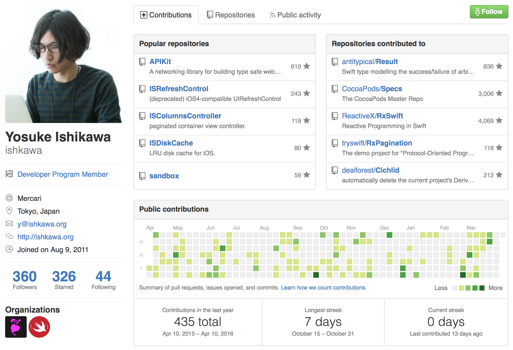
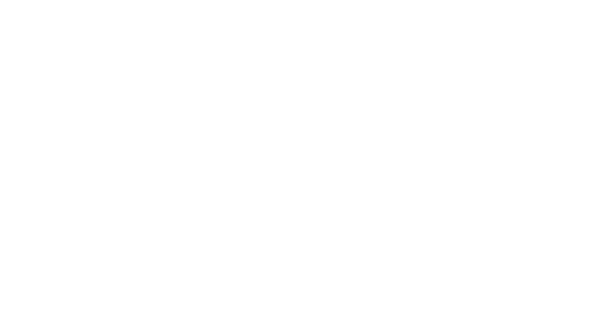
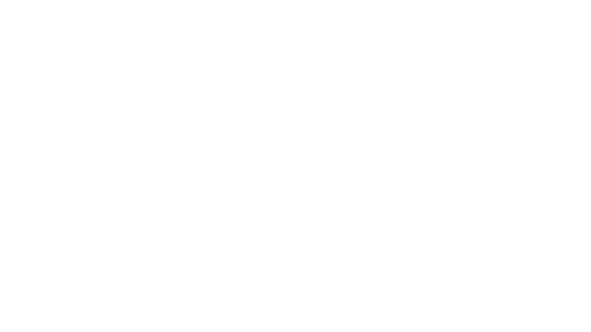
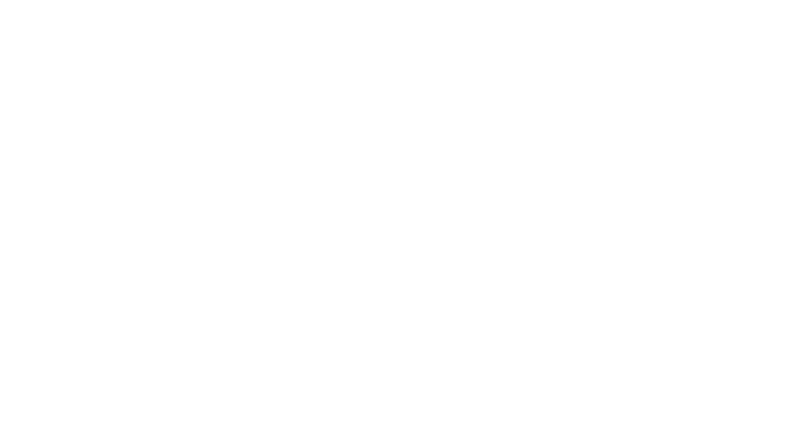
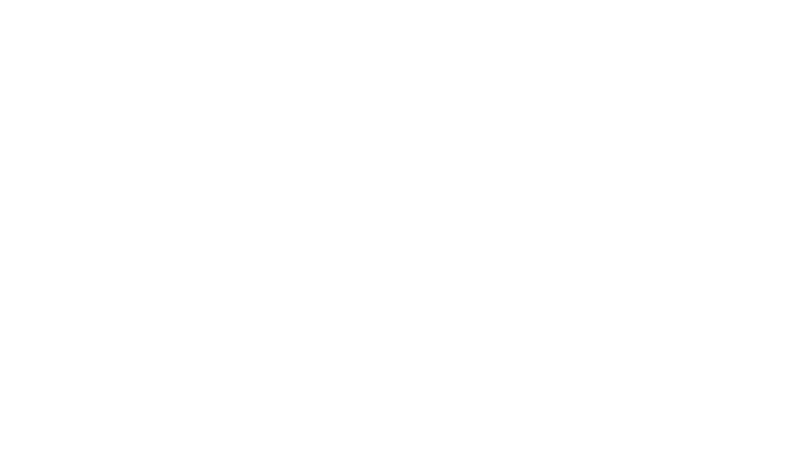
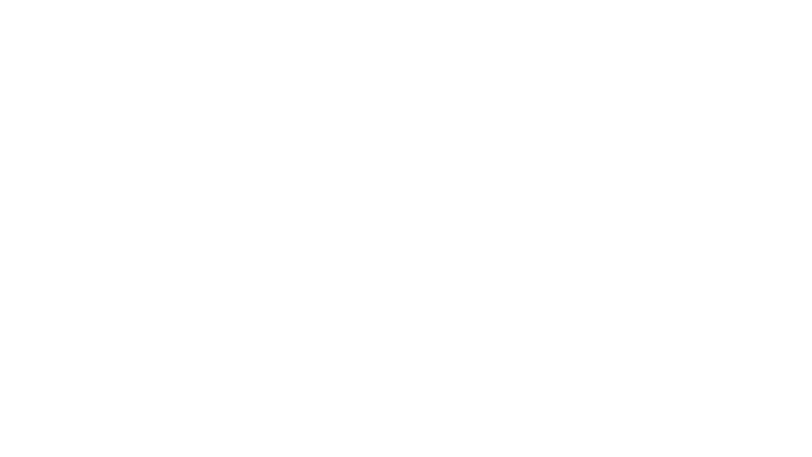
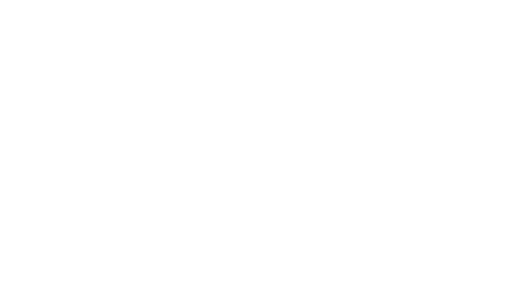
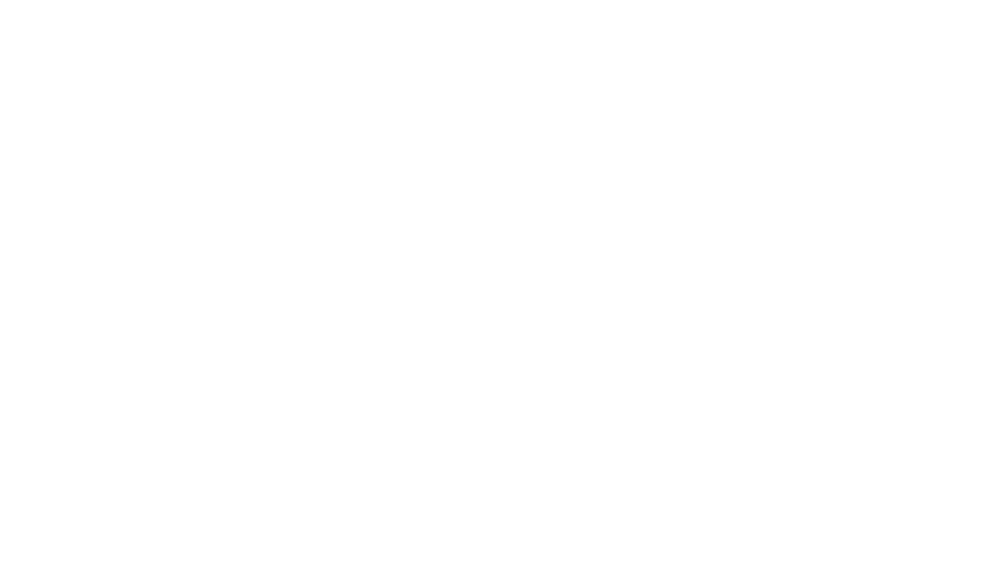

# RxSwift + MVVM
#### ishkawa

Note:
- それでは、発表を始めます。
- よろしくお願いします。


## ishkawa?



Note:
- メルカリで働いているishkawaです。
- APIKitというネットワーキングライブラリをつくっています。


## 近況

- 新プロジェクトでRxSwiftをハードに使った
- 試行錯誤で大変だったけど良いところもわかってきた


## RxSwift + MVVMを前提とした設計


MVVM: レイヤーの切り分けが良い感じ


### UIは変わりやすい


Note:
- UIは変わりやすいという性質がある
- 仕様変更やリニューアル
- バリエーションが複数あることもある


### データの操作は変わりにくい


Note:
- UIを通じて行う操作は変わりにくい
- タップ -> API -> 結果反映








RxSwift: データのUIへの反映が自動的





`Observable<T>`


### `Observable<T>`を3行で

- `T`の値が流れてくる川
- 演算できる (map, filter, zipなど)
- `Observer<T>`に接続できる








```swift
class TweetView: UIView {
    ...

    func bind() {
        view.likeButton.rx_tap
            .bindTo(viewModel.likeTrigger)
            .addDisposableTo(disposeBag)

        viewModel.liked
            .bindTo(view.likeButton.rx_selected)
            .addDisposableTo(disposeBag)
    }
}
```


### View

- 1度ストリームを繋いでしまえば反映は自動的
- やることは入出力のストリームを接続するだけ
- 実装コストは低いので頻繁に変更されてもつらくない


### ViewModel

- 実装コストは高いが変更されにくい


## 画面を跨ぐグローバルなイベント


- 状態の変更は画面間で共有されてほしい
- グローバルなものはグローバルなもので表そう


```swift
final class GlobalObservables {
    static let likedItem = PublishSubject<Item>()
}
```


`Subject<T>`

- `Observable<T>`であり`Observer<T>`でもある
- グローバルな`Subject<T>`があると...
  - どこからでも変更を流せる
  - どこからでも変更を購読できる








- `Observable<Item>`に値を流すのはViewModel
- `Observable<Item>`を購読するのもViewModel
- ViewにはViewModelの値をバインドするだけ


### 画面間の変更の共有

- 変更はグローバルな`Observable<T>`で通知
- 値の送信も購読もViewModelが担当する
- Viewは画面間の同期について考える必要がない
  - バインドしてれば自動的に同期される


# まとめ

- 変更されやすい箇所と変更されにくい箇所がわかれる
- 変更されやすい箇所の実装コストは低い
- 実装コストが高いところは変更されにくい
