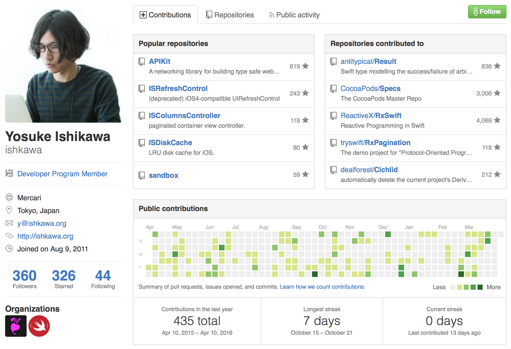
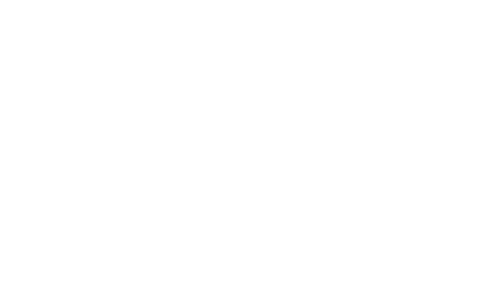
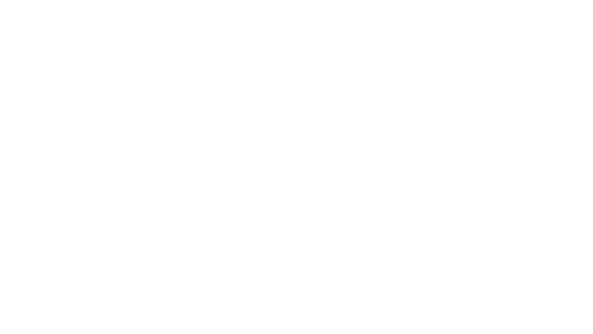
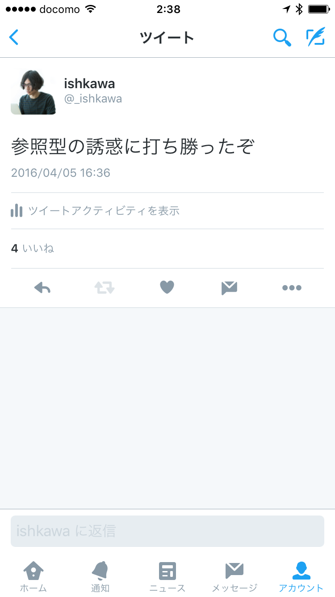

# RxTests
#### ishkawa


## ishkawa?













### UIのテストは大変

- すぐ壊れる
- タイミング制御が難しい
- 成功の確認が難しい


### ViewModelならいけるかも？

- 壊れにくい
- 仮想時間でタイミング制御できる
- 成功の確認が簡単


```swift
let character = scheduler.createObserver(Character)
let scheduler = TestScheduler()

scheduler.scheduleAt(10) { character.onNext("a") }
scheduler.scheduleAt(20) { character.onNext("b") }
scheduler.scheduleAt(30) { character.onNext("c") }
scheduler.start()

XCTAssertEqual(character.events, [
    next(10, "a"),
    next(20, "b"),
    next(30, "c"),
])
```


# Live!
