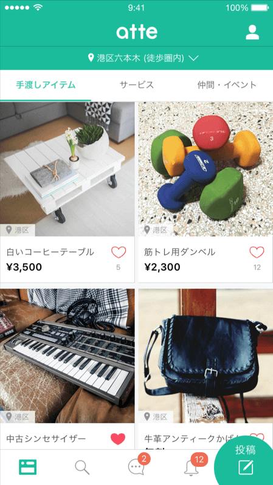

# Swift + JSON-RPC
#### ishkawa


## ishkawa?


## JSON-RPC?


JSON-RPC is a stateless, light-weight

remote procedure call (RPC) protocol.


- HTTP bodyのJSONでリクエストを記述する
- 1回の通信で複数のリクエストを実行できる


## 何に使うの？





- タイムラインの投稿を取得する
- タイムラインの座標を住所に変換する
- バナーを取得する


## GET /home ?


- 複数の処理をまとめたAPIは仕様が壊れやすい


## JSON-RPC Batch


- 個々の処理をメソッドとして定義
- クライアント側で1つのリクエストにまとめる
- 情報の組み合わせの変更に強い


### Request

```json
[
    {
        "id": "XXXXXXXX-XXXX-XXXX-XXXX-XXXXXXXXXXXX-X",
        "jsonrpc": "2.0",
        "method": "GetTimelineOffers",
        "params": { ... }
    },
    {
        "id": "XXXXXXXX-XXXX-XXXX-XXXX-XXXXXXXXXXXX-X",
        "jsonrpc": "2.0",
        "method": "GetBanners",
        "params": { ... }
    }
]
```


### Response

```json
[
    {
        "id": "XXXXXXXX-XXXX-XXXX-XXXX-XXXXXXXXXXXX-X",
        "jsonrpc": "2.0",
        "result": { ... }
    },
    {
        "id": "XXXXXXXX-XXXX-XXXX-XXXX-XXXXXXXXXXXX-X",
        "jsonrpc": "2.0",
        "result": { ... }
    }
]
```


### Swiftでどう表現する？


### APIKitの仕組みに乗ろう


- リクエストの型が決まればレスポンスの型も決まる

```swift
let request = SomeRequest()
let response = Session.rx_response(request)
// responseの型はObservable<SomeRequest.Response>
```


### 複数のリクエストに拡張しよう


```swift
let requestA = RequestA()
let requestB = RequestB()
let response = Session.rx_response(requestA, requestB)
// responseの型はObservable<(RequestA.Response, RequestB.Response)>
```


### タプルの要素数は？

```swift
Session.rx_response(requestA, requestB)
Session.rx_response(requestA, requestB, requestC)
Session.rx_response(requestA, requestB, requestC, requestD)
```


### 筋肉で解決💪


```swift
// apple/swiftにおける筋肉の活躍
func ==<A: Equatable, B: Equatable>(lhs: (A, B), rhs: (A, B)) -> Bool
func ==<A: Equatable, B: Equatable, C: Equatable>(lhs: (A, B, C), rhs: (A, B, C)) -> Bool
func ==<A: Equatable, B: Equatable, C: Equatable, D: Equatable>(lhs: (A, B, C, D), rhs: (A, B, C, D)) -> Bool
func ==<A: Equatable, B: Equatable, C: Equatable, D: Equatable, E: Equatable>(lhs: (A, B, C, D, E), rhs: (A, B, C, D, E)) -> Bool
func ==<A: Equatable, B: Equatable, C: Equatable, D: Equatable, E: Equatable, F: Equatable>(lhs: (A, B, C, D, E, F), rhs: (A, B, C, D, E, F)) -> Bool
```


```swift
extension Session {
    func rx_response
        <RequestA: RPCRequest, RequestB: RPCRequest>
        (requestA: RequestA, requestB: RequestB) ->
        Observable<(RequestA.Response, RequestB.Response)> {
        ...
    }

    func rx_response
        <RequestA: RPCRequest, RequestB: RPCRequest, RequestC: RPCRequest>
        (requestA: RequestA, requestB: RequestB, requestC: RequestC) ->
        Observable<(RequestA.Response, RequestB.Response, RequestC.Response)> {
        ...
    }
}
```


```swift
let bannerRequest = BannerRequest()
let timelineRequest = TimelineRequest()

// Observable<(BannerRequest.Response, TimelineRequest.Response)>
let batchResponse = Session
    .rx_response(bannerRequest, timelineRequest)
    .shareReplay(1)
```


```swift
batchResponse
    .map { bannerResponse, timelineResponse in
        return bannerResponse.banner
    }
    .bindTo(banner)
    .addDisposableTo(disposeBag)

batchResponse
    .map { bannerResponse, timelineResponse in
        return timelineResponse.offers
    }
    .bindTo(offers)
    .addDisposableTo(disposeBag)
```


```swift
batchResponse
    .map { $0.0.banner }
    .bindTo(banner)
    .addDisposableTo(disposeBag)

batchResponse
    .map { $0.1.offers }
    .bindTo(offers)
    .addDisposableTo(disposeBag)
```


## まとめ


- JSON-RPCは複数のリクエストを1個にまとめられる
- APIKitの考え方はJSON-RPC Batchにも適用できる
- (A, B) -> Observable<(A.Response, B.Response)>
- 筋肉をつけよう💪
