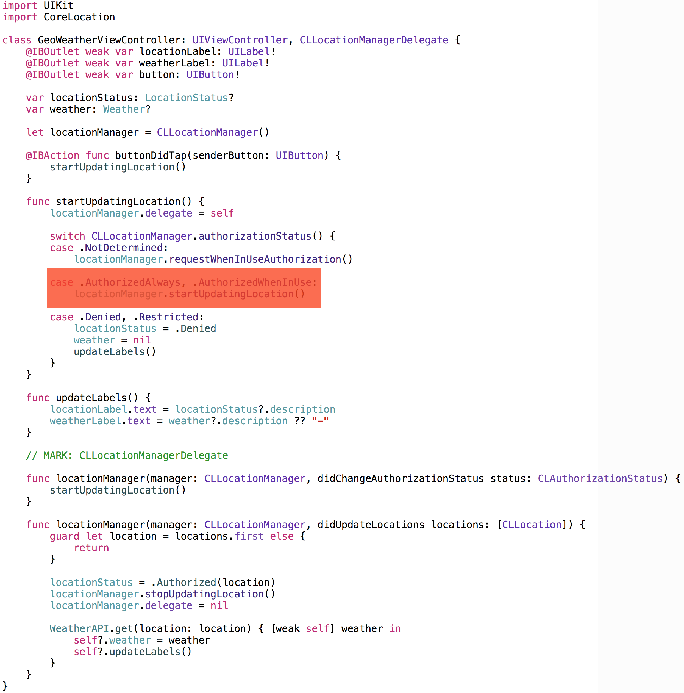
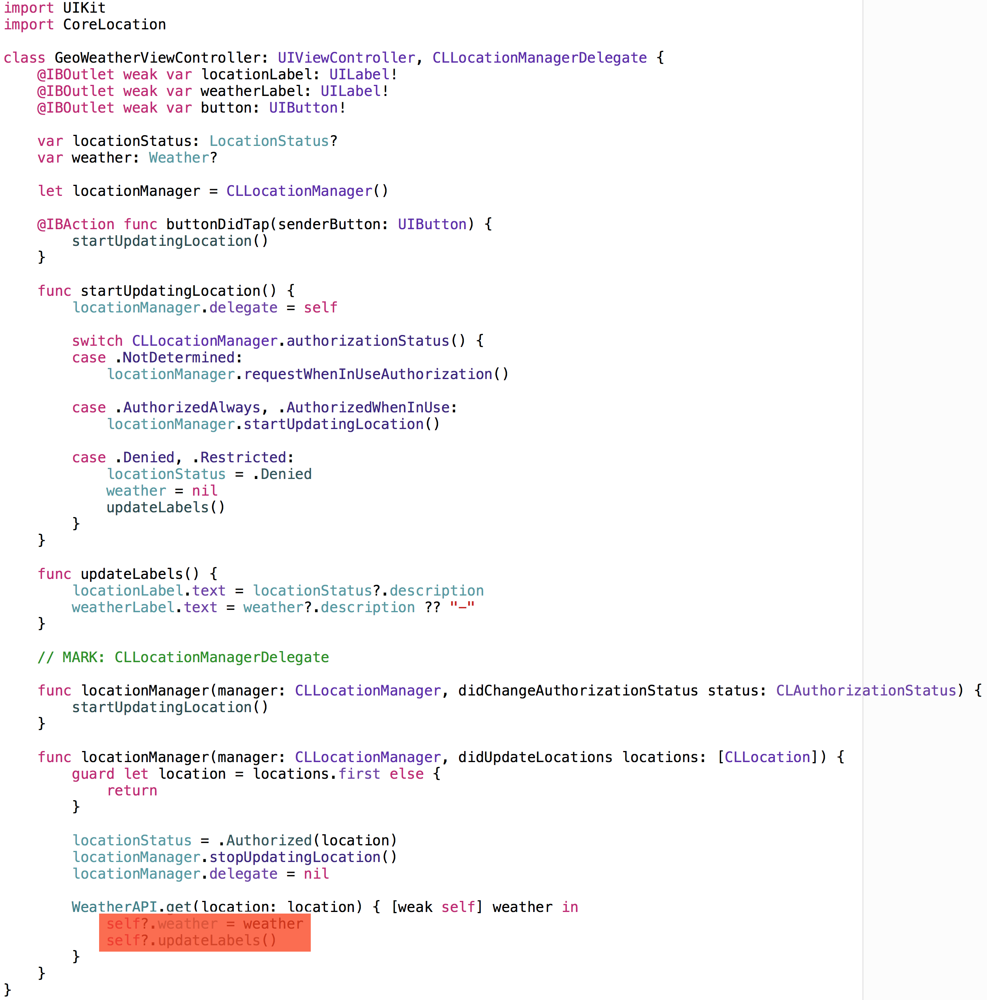

# RxSwiftは開発を
# どう変えたか?

Note:
- RxSwiftは開発をどう変えたか?というタイトルで発表させていただきます。
- 石川と申します。


Note:
- はじめに自己紹介をします。
- 僕はメルカリの新規事業チームで働いているiOSエンジニアです。
- これはGitHubのプロフィールページなんですが、ここにもある通り、いくつかのオープソースプロジェクトにコミットしています。
- また、自分でもAPIKitというライブラリをつくったりしています。
- そんなところですかね。


# RxSwift

Note:
- 今日はRxSwiftについてお話しします。
- はじめに質問しておきたいのですが、RxSwiftを使ったことがある方ってどのくらいいらっしゃいますか？
- 逆に、RxSwiftはまだあまり触ったことがないという方はどのくらいいらっしゃいますか？
- 今日はどちらの方にも役立つような話になると良いなと思って準備してきました。
- はじめにRxSwiftのごく基礎的な概念を説明して、続いてアプリのイベントの扱い方がどのように変わるのか説明します。
- 今日Rxは初めてだという人にもRxのイメージを掴んで頂ければなと思っています。


# RxSwift

イベントストリームを抽象化

Note:
- それでは早速RxSwiftの説明に入っていきましょう。
- RxSwiftは一言で言うと、イベントストリームを抽象化するライブラリです。
- イベントというのはUIButtonがタップされたとか、UISegmentedControlの選択値が変わったとか、UITextFieldのテキストが編集されたとか、そういうものを指します。


```none
-------[a]-------------[ab]-------------[abc]-------
```

Note:
- 例えば、UITextFieldで"abc"と入力すると、テキストはこのように変化します。
- この時点では"a"、この時点では"ab"、この時点では"abc"というものですね。
- 個々の要素がイベントで、一連の流れをイベントストリームと呼んでいます。


# Observable&lt;Element&gt;

イベントストリームを表す型

Note:
- RxSwiftでは、イベントストリームを`Observable<Element>`というジェネリック型で表します。
- `Observable`の使い方はこのあとすぐに説明するのですが、まずはどのように取得できるのか見てみましょう。


```swift
let textField = UITextField()
let text = textField.rx_text // Observable<String>
```

Note:
- 例えば、`UITextField`のテキストの変化を表すイベントストリームは、`rx_text`というプロパティで`Observable<String>`として取得できます。
- このように、RxSwiftではiOS SDKの各種クラスのイベントストリームは`Observable`として取得できるようにしています。
- これは厳密には、RxCocoaというRxSwiftとセットで提供されているライブラリが担当しています。


# subscribe(\_:)

イベントごとにクロージャを実行

Note:
- では、次に`Observable`の個々のイベントの受け取り方を説明します。
- 個々のイベントを受け取るには、`Observable`の`subscribe(_:)`メソッドにクロージャを渡します。
- すると、イベントの発生ごとにクロージャが実行されて、引数には新しいイベントの値が入ります。


```swift
let textField = UITextField()
let text = textField.rx_text
text.subscribe { print($0) }
```

イベントごとに値を出力

Note:
- このサンプルコードは`UITextField`のテキスト編集を表すObservableをsubscribeする例で、
- テキストの変更ごとに新しい値がクロージャに渡されます。


<video loop data-autoplay src="./img/subscribe.mov"></video>

Note:
- このサンプルコードは`UITextField`のテキスト編集を表すObservableをsubscribeする例で、
- この動画はサンプルコードの動作の様子です。
- UITextFieldのテキストが変更される度に新しい値がコンソールに流れていますね。
- これがsubscribeです。


# bindTo(\_:)

Observer&lt;Element&gt;(概念)に自動反映する

Note:
- 続いて、もう1つのイベントの受け取り方であるbindToを説明します。
- bindはイベントストリームを`Observer<Element>`に接続するというものです。
- `Observer`はイベントストリームを受け取るもので、`Observable`と対になる概念です。
- `Observable`はイベントストリームが湧き出るところだったのに対し、`Observer`はイベントストリームを流し込むところとなります。
- つまり、`Observable`と`Observer`は入出力の関係にあるということですね 。


```swift
let textField = UITextField()
let label = UILabel()
textField.rx_text.bindTo(label.rx_text)
```

UITextFieldからUILabelに自動反映

Note:
- `Observer`の例には、`UILabel`の`rx_text`があります。
- これは`AnyObserver<String>`という型になっていて、`Observable<String>`がバインドできます。
- 例では、`UITextField`の`rx_text`を`UILabel`の`rx_text`にバインドしています。


<video loop data-autoplay src="./img/bind.mov"></video>

Note:
- この動画が先ほどのサンプルコードの動作の様子です。
- UITextFieldのテキストが変更される度に新しい値がUILabelのテキストにも反映されています。
- これがbindです。


- RxSwiftはイベントストリームを抽象化するライブラリ
- イベントストリームはObservable&lt;Element&gt;で表される
- subscribe(\_:)でイベントを個別に受け取れる
- bindTo(\_:)でイベントストリームを接続できる

Note:
- ここまでの説明で、Observableの概念と使い方が何となく掴めたのではないかと思います。
- 簡単におさらいしてみましょう。
- RxSwiftはイベントストリームを抽象化するライブラリだということ
- イベントストリームはObservable&lt;Element&gt;で表されるということ
- subscribe(\_:)でイベントを個別に受け取れること
- bindTo(\_:)でObservableをObserverに接続できるということをこれまでに説明しました。


# Operator

Observableの変換・絞り込み・組み合わせ

Note:
- 次に、Observableの変換・絞り込み・組み合わせを行うオペレーターについて説明します。
- `UITextField`と`UILabel`の例ではObservableをObserverにそのままバインドしていましたが、
- 実際の開発では、`Observable`をアプリのロジックに沿ってオペレーターで加工して、Observerにバインドするということをします。


- 変換 :  map, flatMap, scan, debounce
- 絞り込み :  filter, take, skip, distinct
- 組み合わせ :  zip, combineLatest, merge, sample, concat

Note:
- RxSwiftには多数のオペレーターが用意されています。
- ここでは、ざっくりした分類でよく使われるものをリストアップしました。
- map, flatMap, filterあたりはArrayやOptionalでもお馴染みですよね。


```swift
textField.rx_text
   .map { "\($0.characters.count)" }
   .bindTo(label.rx_text)
```

UITextFieldの文字数をUILabelにバインド

Note:
- mapを例にオペレーターの動作を見てみましょう。
- mapはArrayやOptionalのmapと同様で、値ごとにクロージャを実行し、変換した要素を返すというものです。
- この例では、mapでテキストの`characters.count`を返しているので、文字数がUILabelにバインドされます。


<video loop data-autoplay src="./img/bindmap.mov"></video>

Note:
- この動画が先ほどのサンプルコードの動作の様子です。
- UITextFieldのテキストが変更される度に新しい値がUILabelのテキストにも反映されています。
- これがmapオペレーターの変換による結果です。


<video loop data-autoplay src="./img/combineLatestAndSample.mov"></video>

Note:
- 続いて、もう少しアプリらしい例を考えてみましょう。
- この動画のように、2つの`UITextField`と1つの`UIButton`があり、`UIButton`を押すと、
- 2つのテキストを組み合わせたテキストがラベルに表示されるという画面をつくります。


```swift
let button = UIButton()
let textField1 = UITextField()
let textField2 = UITextField()
let label = UILabel()

Observable
    .combineLatest(
        textField1.rx_text,
        textField2.rx_text) { "\($0) \($1)" }
    .sample(button.rx_tap)
    .bindTo(label.rx_text)
    .addDisposableTo(disposeBag)
```

Note:
- 元の2つのUITextFieldのObservableから目的のObservableを引き出すには、combineLatestとsampleというオペレーターを使います。
- `combineLatest`は複数の`Observable`の最新の値を組み合わせて、新たな`Observable`を返すというオペレーターです。
- このオペレーターより、2つの`UITextField`の最新の値を組み合わせた`Observable<String>`が生成できます。
- この`Observable`では、どちらかの`UITextField`に変更がある度にイベントが発生するため、
- "Yosuke Ishikawa"と打ち終わるまでに14個くらいのイベントが流れてしまい、このままでは仕様と合いません。

- `sample`は`Observable`のイベントの発生のタイミングを制御するオペレーターです。
- 今回は`UIButton`をタップした時に`UILabel`のテキストを更新したいので、
- 先ほどの`combineLatest`した`Observable`を`UIButton`の`rx_tap`でサンプルします。
- そして、その結果を`UILabel`にバインドすると仕様を満たせるようになったというわけです。

- これでアプリが作れそうなイメージが湧いてきましたね。


# Rx vs 従来方式

イベントストリームの扱いの違い

Note:
- では、実際のアプリ開発におけるイベントストリームの扱いがRxSwiftによってどう変わったのか、先ほどの例のコードで見てみましょう。


### Rx

Note:
- まず、RxSwiftを使用した場合の`UIViewController`の実装です。


```swift
class ViewController: UIViewController {
    @IBOutlet weak var textField1: UITextField!
    @IBOutlet weak var textField2: UITextField!
    @IBOutlet weak var button: UIButton!
    @IBOutlet weak var label: UILabel!

    private let disposeBag = DisposeBag()

    func viewDidLoad() {
        super.viewDidLoad()

        Observable
            .combineLatest(
                textField1.rx_text,
                textField2.rx_text) { "\($0) \($1)" }
            .sample(button.rx_tap)
            .bindTo(label.rx_text)
            .addDisposableTo(disposeBag)
    }
}
```

Note:
- Rxの場合、ObservableをObserverにバインドするだけなので、`viewDidLoad()`ですべての実装が完了しています。
- `viewDidLoad()`ですべての実装が完了するということがどんな意味を持つか、イメージを掴んでもらうために例え話をするんですが、


### 水道にホースをつなぐイメージ

Note:
- この実装は言ってみれば水道につながったホースのようなものなんです。


Observable&lt;String&gt; × 2

 

Note:
- 2つの`UITextField`の水道がホースにつながっていて、


combineLatest(\_:\_:)


Note:
- これを1つにするジョイントが`combineLatest`、


sample(\_:)


Note:
- 流れるタイミングをコントロールするバルブが`sample`です。
- そして、その先に仕様を満たした水が流れるというイメージです。


```swift
class ViewController: UIViewController {
    ...

    func viewDidLoad() {
        super.viewDidLoad()

        Observable
            .combineLatest(
                textField1.rx_text,
                textField2.rx_text) { "\($0) \($1)" }
            .sample(button.rx_tap)
            .bindTo(label.rx_text)
            .addDisposableTo(disposeBag)
    }
}
```

Note:
- さて、このイメージを持った状態でもう一度コードを見てみましょう。
- 2つの水道があり、1つにするジョイントがあり、流れを制御するバルブがあります。
- そして、その結果が`UILabel`に流れ込んでいます。
- このホースは`viewDidLoad()`で繋いでしまえば、あとは蛇口をひねるだけで仕様通りに水が流れるというわけです。
- これがRxSwiftによるイベントストリームの扱いです。


```swift
class ViewController: UIViewController {
    @IBOutlet weak var textField1: UITextField!
    @IBOutlet weak var textField2: UITextField!
    @IBOutlet weak var button: UIButton!
    @IBOutlet weak var label: UILabel!

    @IBAction func buttonDidTap(senderButton: UIButton) {
        label.text
            = "\(textField1.text) \(textField2.text)"
    }
}
```

Note:
- 同じ仕様を従来のtarget-actionパターンで実装した場合と比較してみましょう。
- target-actionの場合は、ボタンがタップされた時に実行される`buttonDidTap(_:)`メソッドを用意しておき、
- それを`@IBAction`で`UIButton`のタップのハンドラとして登録します。
- 実装は極めてシンプルですし、このケースにおいては率直に言ってこちらの方が読みやすいでしょう。


## バケツに水を入れるイメージ

Note:
- 従来のイベントストリームの扱いは、RxSwiftのホースと対比するとバケツに例えられます。


UITextField × 2

 

Note:
- イベントストリームに流れた値をバケツに入れておき、target-actionのタイミングで、各バケツに入っている値を取りに行って、


UILabel


Note:
- 目的のバケツに移し替えるというイメージです。


```swift
class ViewController: UIViewController {
    @IBOutlet weak var textField1: UITextField!
    @IBOutlet weak var textField2: UITextField!
    @IBOutlet weak var button: UIButton!
    @IBOutlet weak var label: UILabel!

    @IBAction func buttonDidTap(senderButton: UIButton) {
        label.text
            = "\(textField1.text) \(textField2.text)"
    }
}
```

Note:
- あらためてコードを見てみましょう。
- `UITextField`の`text`プロパティがテキスト編集のイベントストリームの最新の値を入れておくバケツになります。
- そして、アクションが発火したタイミングで、このバケツに入った値を取りに行き、
- それらを組み合わせた値を`UILabel`のバケツに値を移し替えます。
- これが従来のイベントストリームの扱いです。


# Rx

- すべてのイベントストリームの表現手段が同じ
- 貯めておいて後で取りに行くという動作がない
  - イベントストリームの依存関係がoperatorで表される

Note:
- イメージはなんとなく掴めましたか？
- 例え話はここまでにして、Rxと従来の方式の一体何が違うのか整理してみましょう。

- Rxでは、イベントストリームをObservableとして抽象化し、それをオペレーターで加工し、Observerにバインドするというものでした。
- 一方、従来の方式ではイベントストリームの最新の値をプロパティに保存し、アクションの発火時にそれを取りに行くというものでした。
- 大きな違いは、2つあります。

- 1つ目はRxはすべてのイベントストリームの表現手段が統一されていて、組み合わせ可能だということです。
- 従来の方式では、テキストの編集とボタンのタップは別のもので表現されていましたが、RxではすべてがObservableです。

- 2つ目はRxには貯めておいて後で取りに行くという動作がないということです。
- これは、イベントの依存関係がオペレーター上で表現されているためです。
- 次は、この特徴によるメリットが大きいケースを見てみましょう。


## 現在地の天気アプリ

Note:
- すべてのイベントストリームをObservableとして扱うと、ある程度複雑なフローも扱い易くなります。
- ここでは、現在地の天気を取得するアプリのイベントストリームを考えてみましょう。


<video loop data-autoplay src="./img/weather_success.mov"></video>
<video loop data-autoplay src="./img/weather_failure.mov"></video>

Note:
- 仕様はこちらの動画のようなものです。
- ボタンをタップすると、位置情報の認可を要求して、認可されたら位置情報を更新し、その位置情報を元にAPIを呼ぶというものです。
- 単純そうに見えて以外と厄介ですね。


1. ボタンのタップ
2. 位置情報の利用の認可状態
3. 位置情報
4. 天気APIのレスポンス

Note:
- このアプリには、4つのイベントストリームがあります。

1. ボタンのタップ
2. 位置情報の利用の認可状態
3. 位置情報
4. 天気APIのレスポンス


```swift
enum Weather {
    case Sunny, Cloudy, Rainy

    var description: String {
        switch self {
        case .Sunny:   return "晴れ"
        case .Cloudy:  return "曇り"
        case .Rainy:   return "雨"
        }
    }
}
```

天気

Note:
- 従来の方式とRxの比較に入る前に共通のものを実装しておきましょう。
- まずは天気のモデルです。
- 晴れと曇りと雨をenumで定義します。
- これは何も難しくないですね。


```swift
final class WeatherAPI {
    static func get(location location: CLLocation, handler: Weather -> Void) {
        let delay = 1.0 * Double(NSEC_PER_SEC)
        let time  = dispatch_time(DISPATCH_TIME_NOW, Int64(delay))

        dispatch_after(time, dispatch_get_main_queue()) {
            handler(Weather.random)
        }
    }
}
```

天気API

Note:
- 続いて、天気のAPIです。
- 実際に繋ぎに行くのが面倒なので、ここでは1秒後にランダムな天気を返すモックAPIを実装します。


```swift
enum LocationStatus {
    case Authorized(CLLocation)
    case Denied

    var description: String {
        switch self {
        case .Authorized(let location):
            let latitude = location.coordinate.latitude
            let longitude = location.coordinate.longitude
            return "\(latitude), \(longitude)"

        case .Denied:
            return "位置情報の利用が許可されていません"
        }
    }
}
```

位置情報 + 認可情報

Note:
- そして、位置情報の状態をよりアプリに特化させて簡略化した型も定義しておきます。
- AuthorizedとDeniedの2つのケースを持つenumで、Authorizedはassociated valueにCLLocationを持っています。
- 正確には、認可状態が未確定だったり、位置情報が読み込み中だったりという中間状態が存在するのですが、最終的に落ち着く状態はこの2つの状態です。

- この型を定義する目的は、アプリが必要とする最低限の情報まで簡略化することで、
- 位置と認可の状態を1つにまとめて管理しやすくするというものです。


## 従来のUIViewController

Note:
- さて、ここでようやく画面の実装に入ります。
- まずは従来の方式で実装してみましょう。


```swift
class GeoWeatherViewController: UIViewController, CLLocationManagerDelegate {
    @IBOutlet weak var locationLabel: UILabel!
    @IBOutlet weak var weatherLabel: UILabel!
    @IBOutlet weak var button: UIButton!

    var locationStatus: LocationStatus? {
        didSet {
            locationLabel.text
                = locationStatus?.description ?? "-"
        }
    }

    var weather: Weather? {
        didSet {
            weatherLabel.text
                = weather?.description ?? "-"
        }
    }
}
```

Note:
- はじめにプロパティから見ていきます。
- UIはラベルが2つとボタンが1つですね。
- それと、locationStatusとweatherをストアドプロパティとして持っていて、セット時にそれぞれラベルを更新します。


```swift
@IBAction func buttonDidTap(senderButton: UIButton) {
    startUpdatingLocation()
}

func startUpdatingLocation() {
    locationManager.delegate = self

    switch CLLocationManager.authorizationStatus() {
    case .NotDetermined:
        locationManager
            .requestWhenInUseAuthorization()

    case .AuthorizedAlways, .AuthorizedWhenInUse:
        locationManager.startUpdatingLocation()

    case .Denied, .Restricted:
        locationStatus = .Denied
        weather = nil
    }
}
```

Note:
- まず、ボタンのタップをトリガーに位置情報のアップデートを始めます。
- `startUpdatingLocation()`メソッドの内部では、認可情報に応じて最初のアクションを切り替えます。
- まだ認可情報が決まっていない、`.NotDetermined`であれば、ユーザーから位置情報の利用の許可をしてもらいます。
- 既に許可されている`Authorized`の場合は位置情報の更新を開始します。
- そして、拒否されている場合はlocationStatusとweatherを更新します。


```swift
// MARK: CLLocationManagerDelegate
func locationManager(manager: CLLocationManager, didChangeAuthorizationStatus status: CLAuthorizationStatus) {
    startUpdatingLocation()
}

func locationManager(manager: CLLocationManager, didUpdateLocations locations: [CLLocation]) {
    guard let location = locations.first else {
        return
    }

    locationManager.stopUpdatingLocation()
    locationManager.delegate = nil

    WeatherAPI.get(location: location)
        { [weak self] weather in
        self?.locationStatus = .Authorized(location)
        self?.weather = weather
    }
}
```

Note:
- 最後に、CLLocationManagerのデリゲートメソッドを見ます。
- 認可情報が変わった場合のdidChangeAuthorizationStatusでは、再度startUpdatingLocationを実行して、認可状態に応じた処理を再実行します。
- 位置情報が更新されたdidUpdateLocationsでは、その情報を元に天気APIを読んで、その結果をプロパティにセットします。


コードの実行を追ってみると...

Note:
- これで実装が終わったんですが、コードの実行順序が想像できますか？
- 図で見てみましょう。








パッと全体のフローを把握するのは難しい


# RxのUIViewController

Note:
- では、これをRxを使って実装するとどうなるのか、この場でやってみましょう。


# Live!


- 複雑な制御もバインドだけで実装できた
- 制御の依存関係が見えるようになった


# まとめ

RxSwiftは開発をどう変えたか？


- イベントストリームを宣言的に扱えるようになった
  - 複雑なイベントストリームでも全体を把握しやすい
  - ストアドプロパティによる状態管理を減らせる


RxSwiftどうですか？


# 宣伝

Swiftの本を出します


- 言語の基礎仕様 + 言語仕様を活かした書き方
- Swift 3.0対応
- 冬に出る予定です！
