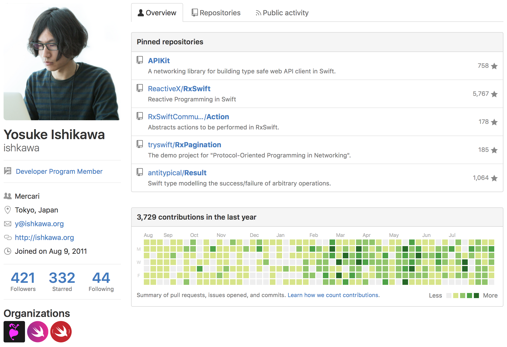
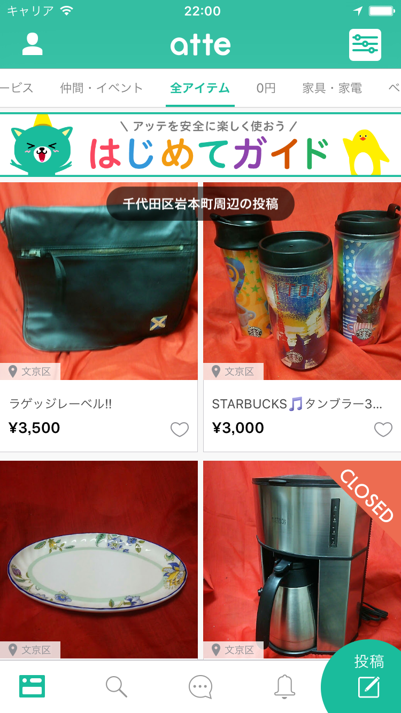

# JSON-RPC on APIKit

Note:
- APIKit上でJSON-RPCを実装する話をします。
- ishkawaです。




Note:
- この人ですね。


# APIKit
リクエストの型に応じてレスポンスの型が変わる

Note:
- まずAPIKitを簡単に紹介します。
- APIKitには、リクエストの型に応じてレスポンスの型が変わるという特徴があります。


```swift
let request = PostTweetRequest(text: "Hello, World.")

Session.sendRequest(request) { result in
    switch result {
    case .Success(let tweet /* is Tweet */):
        ...

    case .Failure(let error):
        ...
    }
}
```

Note:
- 例えば、ツイートを投稿するリクエストを投げれば、レスポンスの型は投稿されたツイートのモデルになるということです。
- このクロージャのSuccessの中のtweetっていうところですね。
- ここが生のJSONではなくて、モデルになるということがポイントです。


```swift
let request = GetTimelineRequest()

Session.sendRequest(request) { result in
    switch result {
    case .Success(let tweets /* is [Tweet] */):
        ...

    case .Failure(let error):
        ...
    }
}
```

Note:
- で、別のリクエストを送ると、レスポンスの型も変わります。
- 例えば、タイムラインを取得するリクエストを投げれば、ツイートのモデルの配列が返ってくるというわけです。
- こんな感じで、APIKitはリクエストの型に応じてレスポンスの型も変えるという仕組みを提供しています。


```swift
protocol RequestType {
    associatedtype Response

    ...
}

class Session {
    func sendRequest<Request: RequestType>(
        request: Request,
        handler: Result<Request.Response, Error>)

    ...
}
```

Note:
- この仕組みはprotocolのassociatedtypeと、そのプロトコルを型制約に持つジェネリックメソッドで実現されています。


# JSON-RPC

リクエストとレスポンスをJSONで表す


### リクエスト

```json
{
  "id": 1,
  "jsonrpc": "2.0",
  "method": "subtract",
  "params": [
    42,
    23
  ]
}
```


### レスポンス

```json
{
  "id": 1,
  "jsonrpc": "2.0",
  "result": 19
}
```


1回の通信で複数のリクエストも送れる


### リクエスト

```json
[
  {
    "id": 1,
    "jsonrpc": "2.0",
    "method": "foo",
    "params": { ... }
  },
  {
    "id": 2,
    "jsonrpc": "2.0",
    "method": "bar",
    "params": { ... }
  }
]
```


### レスポンス

```json
[
  {
    "id": 1,
    "jsonrpc": "2.0",
    "result": { ... }
  },
  {
    "id": 2,
    "jsonrpc": "2.0",
    "result": { ... }
  }
]
```





# APIKit
リクエストの型に応じてレスポンスの型が変わる


# JSON-PRC on APIKit
リクエストの型の<font color="red">組み合わせ</font>に応じて  
レスポンスの型の<font color="red">組み合わせ</font>が変わる


- リクエスト: `(A, B)`
- レスポンス: `(A.Response, B.Response)`


```swift
let batchRequest = BatchRequest(
    GetBannerRequest(id: 1),
    GetPostsRequest(id: 1, coordinate: coordinate),
    GetAddressRequest(coordinate: coordinate))

Session.sendRequest(batchRequest) { result in
    switch result {
    case .Success(let posts, let banner, let address):
        ...

    case .Failure(let error):
        ...
    }
}
```


# 悲報


- Swiftには可変長の型パラメーターがない
- 任意の個数のリクエストの組み合わせが表せない


## 標準ライブラリを参考にしよう

最大6個までのEquatableを比較できる


```swift
func ==<A: Equatable>(lhs: (A), rhs: (A)) -> Bool
func ==<A: Equatable, B: Equatable>(lhs: (A, B), rhs: (A, B)) -> Bool
func ==<A: Equatable, B: Equatable, C: Equatable>(lhs: (A, B, C), rhs: (A, B, C)) -> Bool
func ==<A: Equatable, B: Equatable, C: Equatable, D: Equatable>(lhs: (A, B, C, D), rhs: (A, B, C, D)) -> Bool
func ==<A: Equatable, B: Equatable, C: Equatable, D: Equatable, E: Equatable>(lhs: (A, B, C, D, E), rhs: (A, B, C, D, E)) -> Bool
func ==<A: Equatable, B: Equatable, C: Equatable, D: Equatable, E: Equatable, F: Equatable>(lhs: (A, B, C, D, E, F), rhs: (A, B, C, D, E, F)) -> Bool
```


# 筋肉


## 真似しよう


- 理想: 任意の数のリクエストの組み合わせ
- 現実: 最大3個のリクエストの組み合わせ


```swift
class BatchFactory {
    ...

    func create<R1: RequestType>(request: R1) -> Batch<R1>
    func create<R1: RequestType, R2: RequestType>(request1: R1, _ request2: R2) -> Batch2<R1, R2>
    func create<R1: RequestType, R2: RequestType, R3: RequestType>(request1: R1, _ request2: R2, _ request3: R3) -> Batch3<R1, R2, R3>
}
```


https://github.com/bricklife/JSONRPCKit

1.0.0 beta 1


# 筋肉最高!


# 筋肉最高?

一生筋肉コードを書くのは嫌！


# Swift 4 or later


# Generics Manifesto

将来実装される可能性がある  
おしゃれコード一覧


# Variadic Generics


```swift
struct BatchRequest<... Requests: RequestType>: RequestType {
    typealias Response = (Requests.Response...)

    let (...requests): (Requests...)

    ...
}
```


## 筋肉の時代は終わるのかも？
