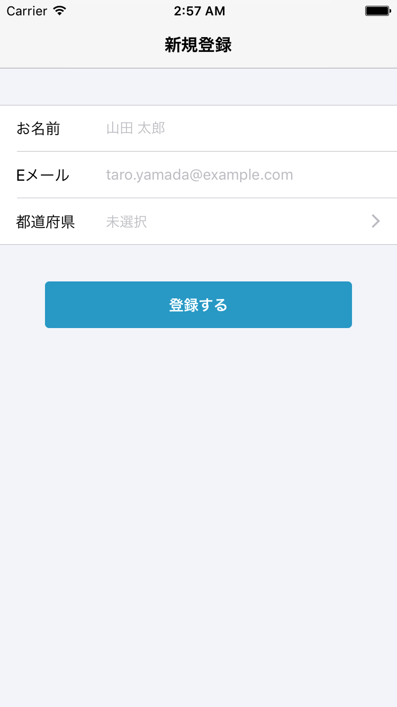

## 実践クライアントサイドSwift

Note:
- こんばんは。ishkawaです。
- 今日2回目のトークで、すごいしゃべりたい人みたいになっちゃいましたね。
- 2回目のトークでは、実践クライアントサイドSwiftというタイトルでお話します。
- クライアントサイドの実装言語にSwiftを使えるのはiOSとかMacくらいなのでアレなんですが、
- なるべくプラットフォーム依存しない、クライアントサイドの問題として話したいと思います。


# 実践的モデリング
入力フォームというエラーの塊を例に

Note:
- では、早速1つ目の実践的モデリングの話に入って行きましょう。
- 今回紹介するモデリングの例は入力フォームです。




Note:
- こちらの画像のようなものですね。
- 入力フォームは、複数のフィールドから構成されます。
- 例えば、この画像の入力フォームには名前・Eメール・都道府県という3つフィールドがあります。
- フィールドというものはある程度共通の性質があります。
- 文字を入力するフィールドには文字数制限があるとか、数字を入力するフィールドには許容範囲があるとか、そういうものです。
- 一方で、フィールドには様々な種類があります。


共通 ⇔ 多様

Note:
- つまり、フォームのフィールドには共通の面と多様な面があるということです。
- そうした両面を適切に捉えてモデリングすることで、入力フォームを安全かつ簡単に扱えるようにするのが目標です。
- 実践的っぽい温度感が伝わりましたか？


## フィールドってなに?

Note:
- では、モデリングの第一歩として、フィールドとはなんなのか考えてみましょう。


名前と値を持っていて、バリデーションができる。

Note:
- ざっくり言ってしまえば、名前と値を持っていて、バリデーションができるものですかね。


Note:
- この例の1つ目のフィールドを見ても、それぞれの名前・値・バリデーションの仕様を持っていることは明らかですよね。


```swift
struct FormField {
    let name: String
    let value: String

    func validate() throws {...}
}
```
文字を入力するフィールド

Note:
- これをSwiftのコードに起こすとこのようなものでしょうか。
- 名前と値のプロパティとバリデーションのメソッドを持っています。
- しかし、このvalueプロパティの型はString型だけで済むわけはないですよね。


Note:
- 1つ目と2つ目のフィールドの値はString型で済みそうですが、
- 3つ目のフィールドは都道府県を表す構造体とかになりそうですよね。


フィールドが持つ値はStringとは限らない。

Note:
- つまり、フィールドが持つ値はStringとは限らないってことです。


```swift
struct FormField<Value> {
    let name: String
    let value: Value

    func validate() throws {...}
}
```
何を入力するフィールドにもなれる型

Note:
- それを考慮すると、今度はこうでしょうか。
- FormField型に値の型パラメーターを追加して、何を入力するフィールドも表せるようにしました。


Note:
- これで名前と値については大丈夫でしょうか。
- 次はバリデーションについて考えます。
- 名前は文字数とか文字種の制限がありそうですね。
- メールアドレスは、それらに加えてフォーマットの制限もありそうですね。
- 都道府県に関しては、文字列のバリデーションとは全く別物になりそうですね。


バリデーションはフィールドの種類によって異なる

Note:
- つまり、バリデーションはフィールドの種類によって異なるってことです。


インターフェースと実装を分けた方がよい

Note:
- ということは、型のインターフェースと実装を分けた方がいいということになり。


ジェネリック型 → プロトコル

Note:
- これはジェネリック型ではなく、プロトコルで表すべきものなんじゃないかということになります。


```swift
protocol FormField {
    associatedtype Value

    var name: String { get }
    var value: Value { get }

    func validate() throws
}
```

Note:
- これがそのプロトコルです。
- 任意の値の型を表すための型パラメーターは、associatedtypeで置き換えられています。
- ジェネリック型からプロトコルに変えるキッカケは、フィールドの種類
- つまり型ごとにvalidate()メソッドの実装を分けたいからでした。
- しかし、プロパティの面でもプロトコルのメリットが出てきます。


フィールドの種類に応じたパラメーターも設定可能

Note:
- それは、フィールドの種類に応じたパラメーターも設定可能というメリットです。


Note:
- フォームを見ながらどういうことか説明します。
- 例えば、同じ文字列を入力する種類のフィールドであれば、似たバリデーションを行うと思います。
- 文字数制限とかそういうものですね。
- しかし、フィールドごとに最大文字数は異なることが多いので、そこはパラメーター化されてて欲しいですよね。
- そういうパラメーターを型ごとに定義できるというのがプロトコルのもう1つのメリットです。


```swift
struct StringFormField: FormField {
    let name: String
    let value: String
    let maxCharactersCount: Int

    func validate() throws {
        if value.isEmpty {
            throw FormFieldError(
                title: "未入力の項目があります",
                message: "\(name)を入力してください")
        }

        if value.characters.count > maxCharactersCount {
            throw FormFieldError(
                title: "文字数がオーバーしています",
                message: "\(name)は\(maxCharactersCount)文字以内で入力してください")
        }
    }
}
```
文字を入力するフィールド

Note:
- そういうことを頭に入れつつ、FormFieldプロトコルに準拠する型を見て見ましょう。
- この型は文字列のフィールドを表す型で、未入力と文字数オーバーのバリデーションを行います。
- 先ほど説明した、フォームの種類固有の最大文字数というパラメーターは、maxCharactersCountというプロパティで表されています。
- そして、validateメソッドでは、そのパラメーターを使ってバリデーションを行っています。
- ようやく使い物になる予感がしてきましたかね。


Note:
- 続いて、もう1種類のフィールドも見てみましょう。
- 3つ目の、都道府県を選択するフィールドです。


```swift
struct SelectionFormField<Value>: FormField {
    let name: String
    let value: Value?

    func validate() throws {
        if value == nil {
            throw FormFieldError(
                title: "未選択の項目があります",
                message: "\(name)を選択してください")
        }
    }
}
```
値を選択するフィールド

Note:
- 選択するタイプのフィールドは値の有無が重要で、その値自体の性質は関係ないのでジェネリックに書けます。
- 選択される値の型を型パラメーターとしてあげて、フィールド自体の値はそのオプショナルとします。
- validate()メソッド内では値の有無を検査します。
- こうすることで、選択するタイプのフィールドをモデル化できました。


順調？

Note:
- ここまで、順調ですかね。


```swift
let selectionFormField = SelectionFormField(
    name: 都道府県,
    value: "東京都")

try selectionFormField.validate()

let product = selectionFormField.value!
```

Note:
- では、モデリングしたフィールドを使う方のコードを書いて見ましょう。
- まず名前と値を与えてインスタンス化して、try validate()して、そして、値を取り出すと。
- 早くも雲行きが怪しい感じがしてきましたね。
- では、何が悪いのか考えてみましょう。


1. バリデーションを行う
2. 値を取り出す

操作の順序という暗黙のルールに依存

Note:
- この構造の悪いところは、正しい動作が操作の順序という暗黙のルールに依存してしまうというところです。
- 例えば、バリデーションを行わずいきなり結果をとって使うということもできちゃいますよね。
- そういうことを防ぐためには、設計を変える必要があります。
- では、そうすればいいかと言いますと、


## 良い設計は誤った用法を
## コンパイルエラーにする

Note:
- そうした誤った用法がコンパイルエラーになるように設計したら良いんですね。
- これが、今日一番言いたかったことです。
- 「良い設計は誤った用法をコンパイルエラーにする」です。
- せっかくなので、ツイートしていただいても良いですよ。


## 良い設計は誤った用法を
## コンパイルエラーにする
(なるべく)

Note:
- ただし、なんでもそうできるわけでもないので、なるべくですかね。


```swift
let selectionFormField = SelectionFormField(
    name: 都道府県,
    value: "東京都")

try selectionFormField.validate()

let product = selectionFormField.value!
```
バリデーションと値の取り出しが別々

Note:
- はい、雰囲気でドヤったところで、利用側のコードを見直してみましょう。
- これに操作の順序という暗黙のルールが生まれるのは、バリデーションと値の取り出しが別々だからですね。
- これらを同時に行うというのが改善案です。


```swift
protocol FormField {
    associatedtype Value
    associatedtype Product

    var name: String { get }
    var value: Value { get }

    func buildProduct() throws -> Product
}
```
バリデーションと結果の取得を同時に行う

Note:
- これまでのvalidate()メソッドを改善して、buildProduct()メソッドにしました。
- このメソッドは新たに追加されたassociatedtypeのProductを返します。
- Productは要するに正しいValueからインスタンス化できる型ですね。


```swift
struct SelectionFormField<Value>: FormField {
    let name: String
    let value: Value?

    func buildProduct() throws -> Value {
        guard let value = value else {
            throw FormFieldError(
                title: "未選択の項目があります",
                message: "\(name)を選択してください")
        }
        return value
    }
}
```
修正版の値を選択するフィールド

Note:
- このプロトコルを使って、選択するフィールドのモデルを改善してみましょう。
- buildProduct()メソッドは非オプショナルなValueを返しており、これがProductとなります。
- これでバリデーションと結果の取り出しを同時に行えるようになりました。
- それと、余談なんですが、ここでtypealias Productがないじゃんって思った方はSwift実践入門の第7章をご覧ください。


```swift
let selectionFormField = SelectionFormField(
    name: 都道府県,
    value: "東京都")

let product = try selectionFormField.buildProduct()
```
バリデーションと結果の取得が同時になった

Note:
- 利用側もバリデーションと結果の取り出しを同時になっていますね。
- そして、これで暗黙のルールを排除できました。
- ここまでで、フィールドのモデリングは一旦終わりです。


## 入力フォームってなに?

Note:
- 今度は入力フォームのモデリングの話に移ります。


フィールドを集めて、結果をまとめるもの。

Note:
- ざっくり言ってしまえば、フィールドを集めて、結果をまとめるものですね。


Note:
- この例では、名前・Eメール・都道府県という3つのフィールドの結果をまとめるのが
- 新規登録フォームという入力フォームですよね。
- イメージはわきましたか？


```swift
struct SignUpForm {
    let nameField: StringFormField
    let emailField: EmailFormField
    let prefectureFormField: SelectionFormField<Prefecture>

    init(name: String, email: String, prefecture: Prefecture?) {...}
}
```

Note:
- コードに起こすとこんな感じでしょうかね。
- それぞれFormFieldプロトコルに準拠した型のプロパティを3つ持っているという感じです。


フィールドを集めて、結果をまとめるもの。

Note:
- 先ほど、入力フォームはフィールドを集めて結果をまとめるものだと言いました。


フィールドのエラーやプロダクトをまとめるもの。

Note:
- 結果と言いましたが、もうちょっと具体的にするとエラーやプロダクトをまとめるということですね。


```swift
protocol Form {
    associatedtype Product

    func buildProduct() throws -> Product
}
```

Note:
- ということは、入力フォームもまたassociatedtype ProductとbuildProduct()メソッドを持ったプロトコルになっていて


```swift
struct SignUpForm: Form {
    let nameField: StringFormField
    let emailField: EmailFormField
    let prefectureFormField: SelectionFormField<Prefecture>

    init(name: String, email: String, prefecture: Prefecture?) {...}

    // SignUpRequestはAPIのリクエストを表す型
    func buildProduct() throws -> SignUpRequest {...}
}
```

Note:
- そのプロトコルに準拠する型はこんな風になるんじゃないかと考えられますね。
- 入力フォームのプロダクトは各フィールドのプロダクトを組み合わせて作成されるもので、
- 例えば新規登録フォームなら、新規登録APIのリクエストでしょうか。


```swift
struct SignUpForm: Form {
    let nameField: StringFormField
    let emailField: EmailFormField
    let prefectureFormField: SelectionFormField<Prefecture>

    init(name: String, email: String, prefecture: Prefecture?) {...}

    // 全フィールドのバリデーションと
    // リクエストの組み立てを同時に行う
    func buildProduct() throws -> SignUpRequest {
        return SignUpRequest(
            name: try nameField.buildProduct(),
            email: try emailField.buildProduct(),
            prefectureID: try prefectureFormField.buildProduct().id)
    }
}
```

Note:
- そのbuildProduct()メソッドの実装はこのようになりますね。
- 各フィールドがバリデーションとプロダクトの取り出しを同時に行えるので、
- それらを取りまとめるフォームもまた、全フィールドのバリデーションと
- リクエストの組み合わせが同時にできるというわけです。


```swift
// 入力値をフォームのモデルに渡す
let form = SignUpForm(
    name: nameTextField.text,
    email: emailTextField.text,
    prefecture: prefecturePickerView.selectedValue)

do {
    sendRequest(try form.buildProduct())
} catch {
    // フォームが発生させたエラーをハンドルする
}
```

Note:
- その結果、フォームの利用側のコードはこのようになります。
- UIから受け取った値をフォームに渡して、
- buildProduct()を実行してエラーが起きればハンドルし、
- 成功すればリクエストを送信するという感じです。

- シンプルですね。
- 1つでもフィールドのバリデーションが失敗するとcatch節に移るので安心です。


順調？


```swift
let form = SignUpForm(
    name: nameTextField.text,
    email: emailTextField.text,
    prefecture: prefecturePickerView.selectedValue)

do {
    sendRequest(try form.buildProduct())
} catch {
    // どのフィールドで失敗したの?
}
```

Note:
- 改めて、フォームの利用側のコードをピュアな気持ちで見てみると、
- このcatch節で「どのフィールドが失敗したのか」気になりませんか？


<video loop data-autoplay src="./img/validation.mov"></video>

Note:
- 「どのフィールドが失敗したのか」という情報は例えばこんなUIに使います。
- この例では、都道府県が未選択のままサインアップボタンを押しているので、
- 都道府県の選択画面までエスコートしてあげてるんですね。
- こういうの、実装したことありませんか？


フィールドの識別子が必要

Note:
- これを実現するためには、「どのフィールド」という情報を表す識別子が必要ですよね。
- 識別子の型はIntでもStringでも可能ではありますが、よりSwift的にするなら、enumですかね。


enum & switch文による網羅性

Note:
- なぜなら、enumとswitch文の網羅性チェックが強力だからです。


どのフィールドに対するエラーハンドリングも  
コンパイル時にチェックされる...？

Note:
- この網羅性を利用すれば、どのフィールドに対するエラーハンドリングも
- コンパイル時にチェックされるという状況を作れる気がしてきませんか？


```swift
protocol Form {
    associatedtype FieldID
    associatedtype Product

    func buildProduct() throws -> Product
}
```
フォームにFieldIDを導入


```swift
protocol FormField {
    associatedtype FieldID
    associatedtype Value
    associatedtype Product

    var id: FieldID { get }
    var name: String { get }
    var value: Value { get }

    func buildProduct() throws -> Product
}
```
フィールドにFieldIDを導入


```swift
struct FormFieldError<FieldID> {
    let fieldID: FieldID
    let title: String
    let message: String
}
```
フィールドエラーにもFieldIDを導入


```swift
struct SignUpForm: Form {
    enum FieldID {
        case name
        case email
        case prefecture
    }

    let nameField: StringFormField<FieldID>
    let emailField: EmailFormField<FieldID>
    let prefectureField: SelectionFormField<FieldID, Prefecture>

    init(name: String, email: String, prefecture: Prefecture?) {
        ...
    }
}
```


```swift
struct SignUpForm: Form {
    ...

    init(name: String, email: String, prefecture: Prefecture?) {
        nameField = StringFormField(
            id: .name,
            name: "ユーザー名",
            value: name,
            maxCharactersCount: 20)

        emailField = EmailFormField(
            id: .email,
            name: "メールアドレス",
            value: email)

        prefectureField = SelectionFormField(
            id: .prefecture,
            name: "お住まいの都道府県",
            value: prefecture)
    }
}
```


```swift
let form = SignUpForm(
    name: nameTextField.text,
    email: emailTextField.text,
    prefecture: prefecturePickerView.selectedValue)

do {
    sendRequest(try form.buildProduct())
} catch let error as FormFieldError<SignUpForm.FieldID> {
    switch error.fieldID {
    case .name:
        nameTextField.becomeFirstResponder()
    case .email:
        emailTextField.becomeFirstResponder()
    case .prefecture:
        pushPrefectureViewController()
    }
} catch {
    // ここには来ない👻
}
```


網羅性は利用できたが、惜しい。


```swift
let form = SignUpForm(
    name: nameTextField.text,
    email: emailTextField.text,
    prefecture: prefecturePickerView.selectedValue)

do {
    sendRequest(try form.buildProduct())
} catch let error as FormFieldError<SignUpForm.FieldID> {
                  // ↑この型の存在に気づくのが難しい
} catch {
    // ここは何しなくていいの...？
}
```


1. `FormFieldError<SignUpForm.FieldID>`  
というハンドルすべきエラーが発生する
2. それ以外にハンドルすべきエラーは起きない

という暗黙のルールが発生している。


## 良い設計は誤った用法を
## コンパイルエラーにする


```swift
protocol Form {
    associatedtype FieldID
    associatedtype Product

                     // ↓この時点でエラーの型を失っている
    func buildProduct() throws -> Product
}
```


```swift
protocol Form {
    associatedtype FieldID
    associatedtype Product

    func buildProduct()
        -> Result<Product, FormFieldError<FieldID>>
}
```


```swift
protocol FormField {
    associatedtype FieldID
    associatedtype Value
    associatedtype Product

    var id: FieldID { get }
    var name: String { get }
    var value: Value { get }

    func buildProduct()
        -> Result<Product, FormFieldError<FieldID>>
}
```


`Result<T, Error>`は複数の組み合わせが難しい


```swift
struct SignUpForm: Form {
    let nameField: StringFormField
    let emailField: EmailFormField
    let prefectureFormField: SelectionFormField<Prefecture>

    ...

    func buildProduct() throws -> SignUpRequest {
        return SignUpRequest(
            name: try nameField.buildProduct(),
            email: try emailField.buildProduct(),
            prefectureID: try prefectureFormField.buildProduct().id)
    }
}
```
tryの場合


```swift
struct SignUpForm: Form {
    let nameField: StringFormField
    let emailField: EmailFormField
    let prefectureFormField: SelectionFormField<Prefecture>

    ...

    func buildProduct()
        -> Result<SignUpRequest, FormFieldError<FieldID>> {
        let nameResult = nameField.buildProduct()
        let emailResult = emailField.buildProduct()
        let prefectureResult = prefectureFormField.buildProduct()
        // どうにかして3つを楽に組み合わせたい...
    }
}
```
`Result<T, Error>`の場合


他の言語に聞いてみよう


```swift
struct SignUpForm: Form {
    let nameField: StringFormField
    let emailField: EmailFormField
    let prefectureFormField: SelectionFormField<Prefecture>

    ...

    func buildProduct()
        -> Result<SignUpRequest, FormFieldError<FieldID>> {

        // Curry, Runesを使ってHaskellっぽく
        return curry(SignUpRequest.init)
            <^> nameField.buildProduct()
            <*> emailField.buildProduct()
            <*> prefectureField.buildProduct()
    }
}
```


```swift
let form = SignUpForm(
    name: nameTextField.text,
    email: emailTextField.text,
    prefecture: prefecturePickerView.selectedValue)

// どのcaseを消してもコンパイルエラーになる
switch form.buildProduct() {
case .success(let request):
    sendRequest(request)

case .failure(let error):
    switch error.fieldID {
    case .name:
        nameTextField.becomeFirstResponder()
    case .email:
        emailTextField.becomeFirstResponder()
    case .prefecture:
        pushPrefectureViewController()
    }
}
```


正しく使われていることを  
コンパイル時に保証できるようになった


# まとめ


良い設計は誤った用法を  
コンパイルエラーにする
